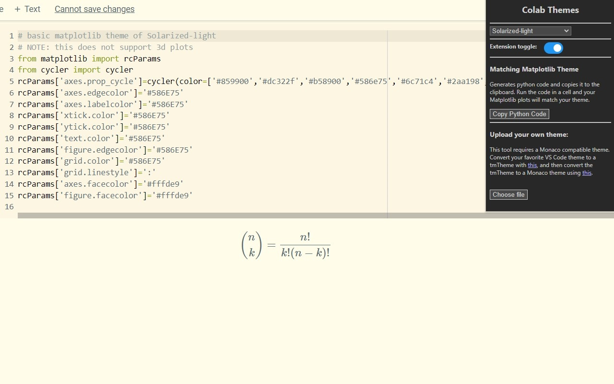

  
   
  <h1>Colab Themes</h1>
   
  
A Chrome extension to stylize Google Colab.
    Changes the page CSS, text editor, and generates Python code to change Matplotlib styles to match the theme the user choses. Users may import themes or use any of the 56 provided. Colab Themes enhances the data science experience by transforming the way users view their code and their data!

   

<h3> Downloads </h3>

  <ul>
  <li><a href="https://chrome.google.com/webstore/detail/hledcfghfgmmjpnfkklcifpcdogjlgig/">Chrome</a></li>
</ul>

<h3> Screenshots </h3>

<table>
  <tr>
    <td></td>
    <td></td>
  </tr>
  <tr>
    <td></td>
    <td></td>
  </tr>
</table>

